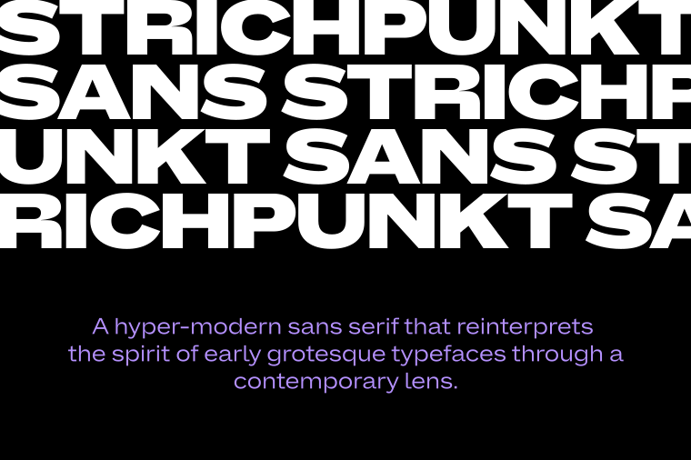
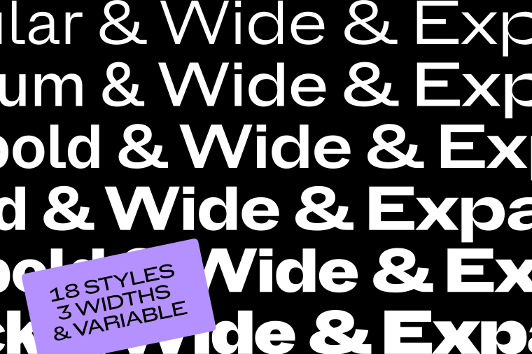
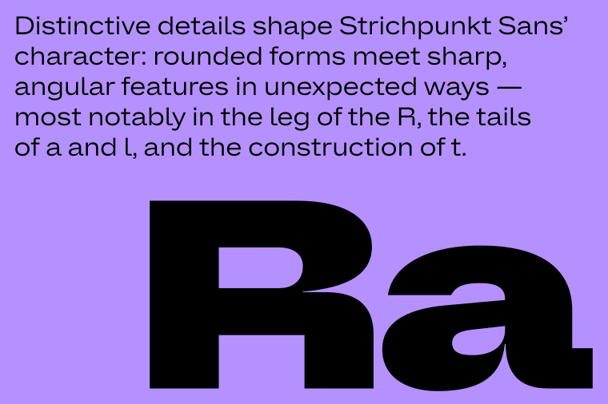
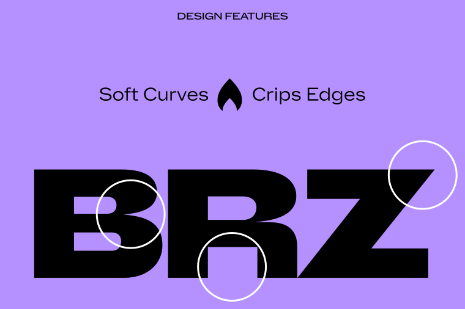
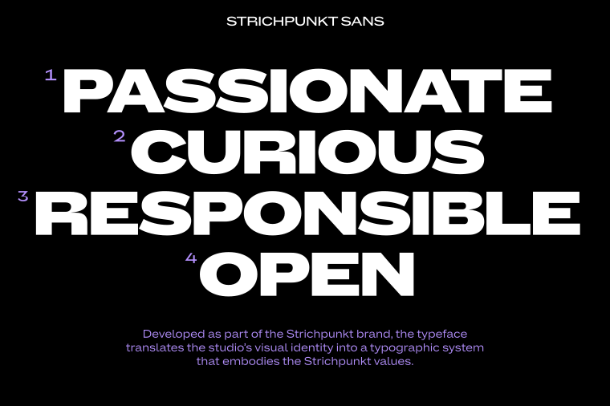
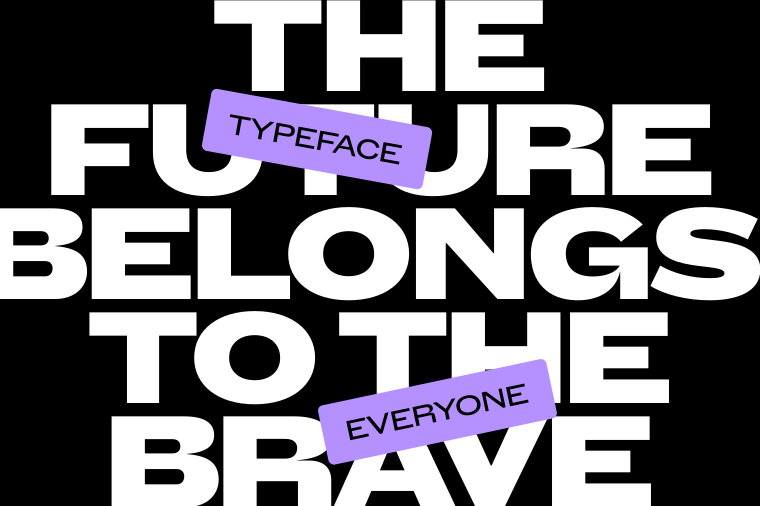
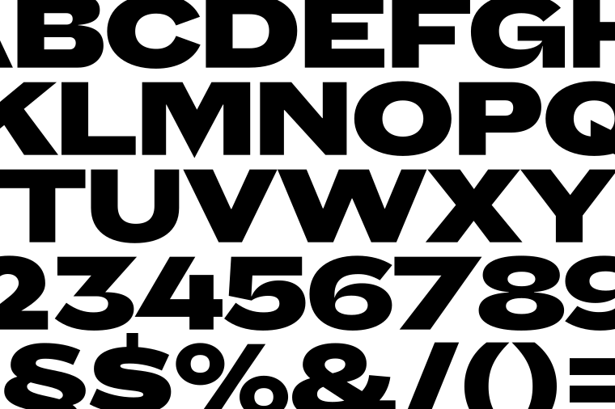

----

# Strichpunkt Sans

**Strichpunkt Sans** is a hyper-modern sans serif that reinterprets the spirit of early grotesque typefaces through a contemporary lens.

The family comprises eighteen styles across three widths (Normal, Wide, and Expanded) ranging from Regular to Black. While the Expanded styles make a confident statement in headlines, the Normal width is optimized for continuous reading and editorial clarity. All styles support Latin Extended and are available in static formats as well as a variable font.

Distinctive details shape its character: rounded forms meet sharp, angular features in unexpected ways: most notably in the leg of the R, the tails of a and l, and the construction of t. 

The sharply tapered joins of letters such as a, n, b, d and q create a dynamic interplay between soft curves and crisp edges. This balance between tradition and forward-looking expression gives the typeface both authority and warmth.

Developed as part of the **Strichpunkt** brand, the typeface translates the studio’s visual identity into a typographic system that embodies the **Strichpunkt** values: Passionate, Curious, Responsible, Open. 

Releasing the typeface as an open-source Google font family reflects a shared commitment to making high-quality contemporary typography accessible to everyone.

## About

**Strichpunkt** is one of the leading design and branding agencies in the German-speaking world. Founded in 1996, the identity and experience specialists work from Stuttgart, Berlin, Hamburg, and Basel (Switzerland) for renowned international clients across all industries and sectors.

[sp.design](https://www.strichpunkt-design.de/de) 
/ [instagram.com/strichpunktdesign](https://www.instagram.com/strichpunktdesign)

## Credits

**René Bieder** is a trained Graphic designer, Art Director, and self-taught type designer. Before setting up his own studio as a type designer in 2012, he was employed in various small and large advertising agencies. Today, you can find his retail typefaces all around the world. From the Nemo Science Museum in Amsterdam to the University of Florida. Next to his retail releases, Bieder has worked with various national and international clients, such as industry giants such as Volkswagen, to create impactful custom brand fonts.

[renebieder.com](https://www.renebieder.com/) / [instagram.com/studio.renebieder](https://www.instagram.com/studio.renebieder)

## Building

Fonts are built automatically by GitHub Actions - take a look in the "Actions" tab for the latest build.

If you want to build fonts manually on your own computer:

* `make build` will produce font files.
* `make test` will run [Fontspector](https://github.com/fonttools/fontspector) quality assurance checks.
* `make proof` will generate HTML proof files.

Note: In Google Workspace, the Expanded width appears as “Strichpunkt Sans Exp” to ensure cross-platform compatibility.

Fonts are built automatically by GitHub Actions. Take a look at the "Actions" tab for the latest build.

## Changelog

**1 March 2026. Version 1.00**

- First release.

## License

Strichpunkt Sans typeface is licensed under the SIL Open Font License, Version 1.1.
This license is available with a FAQ at
https://scripts.sil.org/OFL

## Repository Layout

This font repository structure is inspired by [Unified Font Repository v0.3](https://github.com/unified-font-repository/Unified-Font-Repository), modified for the Google Fonts workflow.
